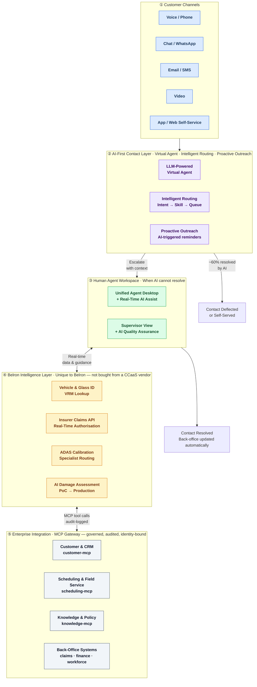

# Contact Centre of the Future
## Target Architecture — Executive View

*One page. Five layers. This is what we're building.*

---

---

## How to read this

| Layer | What it is | The strategic point |
|---|---|---|
| **① Customer Channels** | Every way a customer can reach Belron | Omnichannel from day one — channel doesn't determine outcome |
| **② AI-First Contact Layer** | LLM virtual agents, intelligent routing, proactive outreach | Target: ~60% of contacts resolved without a human agent |
| **③ Human Agent Workspace** | Unified desktop with real-time AI assistance | Humans handle complexity — AI handles repetition |
| **④ Belron Intelligence Layer** | VRM/glass lookup, insurer APIs, ADAS routing, AI damage assessment | **Our competitive moat.** No CCaaS vendor can sell this to us — we build it. |
| **⑤ Enterprise Integration** | MCP Gateway connecting to CRM, scheduling, knowledge, back-office | Every agent action is identity-bound, logged, and auditable. Governance not an afterthought. |

---

## The three things to take away

1. **AI-first, not AI-only.** The architecture routes to automation first. Humans are elevated to handle what AI cannot — complexity, empathy, exceptions.

2. **Belron's moat is Layer ④.** Vehicle intelligence, insurer real-time authorisation, ADAS routing, and AI damage assessment are capabilities no generic platform provides. This is where Belron differentiates.

3. **Governance is structural, not bolted on.** Every AI-to-system interaction goes through an MCP Gateway that enforces identity, audit, and policy. This is how we satisfy regulators, auditors, and the IPO process.

---

## What isn't shown (deliberately)

This diagram omits:
- CCaaS vendor selection (open decision — architecture is platform-neutral until chosen)
- Internal system names and legacy estates
- Network topology and data residency detail
- EU AI Act compliance mapping

Full architecture detail: [[2026-05-23-ccotf-reference-architecture]]

---

*EA Owner: Armo · Belron Enterprise Architecture · v0.1 · 2026-05-23*
