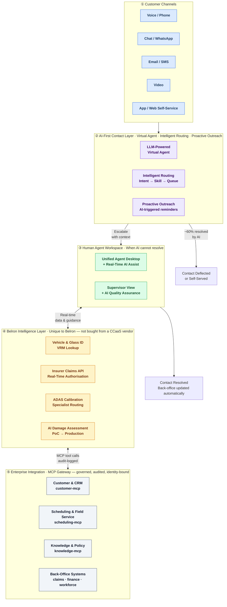

# Contact Centre of the Future — Reference Architecture
*A TOGAF reference model for Belron's AI-native contact centre programme.*

> **Companion document:** [[2026-05-23-ccotf-exec-diagram]] contains the simplified exec stakeholder diagram extracted from this document.
> **Architectural convergence:** This programme connects to two other projects — AI Damage Assessment PoC (CCOTF is the delivery channel) and MCP Governance (the upstream governance layer for CCOTF's agentic AI components). See [[2026-05-23-mcp-agentic-reference-architecture]].

---

## Document Control

| Field | Value |
|---|---|
| Version | 0.1 (Working Draft) |
| Date | 2026-05-23 |
| Owner | Armo, Enterprise Architecture |
| Notation | TOGAF 10 ADM phases A–D; ArchiMate 3.2 vocabulary |
| Review cadence | Quarterly; immediately on CCaaS platform decision |
| Source model | 12-domain CCOTF Technology Component Model (May 2026) |
| **⚠ Key gap** | Belron's current CCaaS platform is not yet confirmed — this RA describes the target state; a gap analysis against current state is a dependency |

---

## Executive Architecture Diagram

*Simplified view for stakeholder communication. Full detail in sections below.*



**Reading the diagram for stakeholders:**
- Layers ①–② represent the *automation-first* principle: resolve without a human wherever possible.
- Layer ③ is the *assisted human* layer: when a human is needed, they are supported by real-time AI guidance, not working alone.
- Layer ④ is Belron's **competitive moat** — the vehicle, glass, insurer, and calibration intelligence that no generic CCaaS vendor can replicate.
- Layer ⑤ is the **governance backbone** — all agent-to-system calls are logged, identity-bound, and auditable via the MCP Gateway.

---

# Phase A — Architecture Vision

## A.1 Purpose

Provide a reference model for the Contact Centre of the Future programme that:

1. Describes the target-state architecture in vendor-agnostic component terms
2. Anchors the programme to Belron's existing business capability model (bridging the capability–technology gap)
3. Makes explicit the connection to the AI Damage Assessment PoC (CCOTF is the delivery channel) and the MCP Governance framework (the governance layer for CCOTF's agentic components)
4. Provides a baseline for gap analysis against Belron's current contact centre technology estate
5. Serves as an honest representation of vendor ownership, data proximity, and lock-in risk — suitable for exec and IPO-context conversations

## A.2 Scope

**In scope:** the technology components, application services, data flows, and governance controls for Belron's contact centre function across all opcos (Autoglass UK, Carglass EU, Safelite US, and other markets). Target state: AI-native, omnichannel, agentic where appropriate, governed.

**Out of scope:** individual opco CCaaS configuration; telephony carrier selection; specific insurer API contracts; workforce headcount modelling. These are implementation concerns.

## A.3 Architecture Drivers

| Driver                                                                                                                                                                         | Source                                                                  |
| ------------------------------------------------------------------------------------------------------------------------------------------------------------------------------ | ----------------------------------------------------------------------- |
| **D1.** Persistent contact centre problems (routing quality, agent productivity, omnichannel consistency) remain unsolved by vendor AI add-ons — structural redesign is needed | Zoom EBC observation, May 2026: "same problems as HSBC, still problems" |
| **D2.** AI-first contact — LLM-powered virtual agents can now resolve 50–60% of contacts without human involvement                                                             | Industry data, May 2026                                                 |
| **D3.** CCOTF is the delivery channel for the AI Damage Assessment PoC — the two programmes must be architecturally coupled                                                    | Consolidation May 2026                                                  |
| **D4.** MCP Governance provides the upstream AI governance layer — Domain 4 (AI & Automation) and Domain 11 (AI Model Governance) must sit within it                           | [[2026-05-23-mcp-agentic-reference-architecture]]                       |
| **D5.** Belron's domain-specific intelligence (VRM, insurer API, ADAS calibration, multi-opco routing) is the differentiator — not the CCaaS platform                          | CCOTF component model, May 2026                                         |
| **D6.** IPO (H2 2026) requires demonstrable technology architecture governance — the contact centre is a significant customer-facing investment                                | Belron exec context                                                     |
| **D7.** EU AI Act Articles 9/12/14 apply to AI agents making customer-facing decisions (routing, damage assessment, claim eligibility)                                         | EUR-Lex                                                                 |
| **D8.** Multi-agent AI systems amplify semantic inconsistency — without shared vocabulary, parallel agents arrive at different answers to the same question                    | Darlene Newman / semantic layer governance braindump, May 2026          |

## A.4 Stakeholders & Concerns

| Stakeholder | Primary concern | Views addressed |
|---|---|---|
| CIO / Exec | Business case, vendor-neutrality, IPO-readiness | Vision, Technology (vendor selection) |
| CCOTF Programme | Deliverable scope, CCaaS platform choice, AI capability roadmap | Application, Technology, Patterns |
| Customer Experience / Operations | Customer outcomes, agent productivity, omnichannel | Business, Application |
| CISO | AI decisions in customer interactions, data egress, PCI/GDPR | Security, Compliance |
| DPO / Legal | EU AI Act, GDPR for customer contact recordings, AI transparency | Compliance |
| MCP Governance (EA) | Domain 4 and Domain 11 components within MCP governance scope | Governance |
| AI Damage Assessment PoC team | Integration point in Domain 4 — CCOTF is the delivery channel | Application (Domain 4) |
| BA team | Capability boundary: CCOTF vs. front-office | Business Architecture |
| Integration Platform team | Domain 10 — API/MCP integration with CRM, FSM, insurers | Application, Technology |

## A.5 Architecture Principles

| # | Principle | Rationale | Implication |
|---|---|---|---|
| **AP-01** | **AI-first, not agent-first** | ~50–60% of contacts can be resolved without a human; humans add value for complexity and empathy, not repetition | Default to virtual agent resolution; human escalation is the exception, not the default path |
| **AP-02** | **Evaluate with explicit rules, not LLM inference** | The Evaluate stage (routing decisions, damage assessment outcomes, claim eligibility) must produce auditable, consistent results. LLM inference at this stage produces variance. | Rule-based evaluation engines layered over LLM retrieval; AI retrieves, rules decide |
| **AP-03** | **CCaaS platform is infrastructure; the Belron intelligence layer is the moat** | The competitive differentiation is VRM lookup, insurer API integration, ADAS routing, and AI damage assessment — not which CCaaS platform is chosen | Invest deeply in Layer ④ (Belron Intelligence); treat Layer ③ (CCaaS) as a commodity infrastructure decision |
| **AP-04** | **The CCaaS platform decision unlocks all other technology decisions** | Everything in this reference model either sits on, integrates with, or is constrained by the CCaaS platform. Candidate selection must happen before detailed architecture work proceeds | No detailed technology design on Domains 3, 5, 6 until CCaaS platform is chosen |
| **AP-05** | **CCOTF's agentic AI components are governed by the MCP Governance framework** | AI decisions in a customer contact are subject to the same audit, identity, and accountability requirements as other enterprise agent actions | Domain 4 (AI & Automation) and Domain 11 (AI Model Governance) connect directly to [[2026-05-23-mcp-agentic-reference-architecture]] |
| **AP-06** | **Architecture must honestly represent vendor ownership and data proximity** | Vendor EBC content presents polished demos; architecture diagrams must show where data lives and which vendor controls it | Diagrams include vendor ownership annotation and data residency; lock-in risks surfaced at design stage |
| **AP-07** | **Semantic consistency is governed, not assumed** | AI agents operating across channels will each interpret business terms (customer, case, closed, authorised) independently unless a shared semantic layer governs meaning | Controlled vocabulary is a pre-requisite for multi-agent CCOTF deployments; semantic layer connects to MCP Governance open issue OI-09 |
| **AP-08** | **Customer-facing AI must comply with EU AI Act Article 13 transparency** | Customers must be informed when interacting with an AI system | All virtual agent and automated decision touchpoints include disclosure |
| **AP-09** | **Multi-opco architecture is the default** | Belron operates in 35+ countries with multiple brands; the architecture must accommodate Autoglass, Carglass, Safelite, and others | CCaaS platform must support multi-brand, multi-language, multi-region without separate deployments |

---

# Phase B — Business Architecture

## B.1 Business Capabilities — CCOTF Scope

The 12 technology domains map to five core business capability clusters. The boundary between CCOTF and the broader front-office is indicated — this boundary is not yet formally resolved (open issue OI-01).

| Capability Cluster | Core Capabilities | CCOTF / Front-office? |
|---|---|---|
| **Customer Contact & Routing** | Omnichannel intake, intent recognition, intelligent routing, callback management | CCOTF primary |
| **Assisted Resolution** | Agent productivity, real-time AI guidance, knowledge surfacing, case management | CCOTF primary |
| **Vehicle & Glass Intelligence** | VRM lookup, glass type identification, damage assessment, ADAS detection | Shared — CCOTF (channel) + AIDA PoC (AI capability) |
| **Claims & Insurer Interaction** | FNOL, insurer pre-authorisation, claim status, settlement | Shared — CCOTF (interaction) + Claims domain (process) |
| **Workforce & Quality** | Agent scheduling, QA, coaching, performance | CCOTF primary |
| **Self-Service & Proactive** | Online booking, appointment tracking, proactive outreach | Boundary TBD — CCOTF vs. Front-office |

## B.2 Business Actors

| Actor Class | Description | CCOTF Role |
|---|---|---|
| **Customer** | Belron end customer (vehicle owner, insurer) | Initiates contact via any channel |
| **Contact Centre Agent** | Belron employee handling customer contacts | Assisted by AI; escalation target |
| **Supervisor** | Team leader / floor manager | AI-augmented monitoring and coaching |
| **Virtual Agent** | AI Actor — autonomous first-line resolution | First contact; resolves or escalates with context |
| **Agentic Workflow** | AI Actor — autonomous multi-step back-office task completion | Post-resolution automation (job creation, claim submission) |
| **Insurer / Third Party** | External system — automated API interaction | Real-time claim authorisation via API |
| **Technician** | Field employee — receives job from Field Service Management | Downstream recipient of CCOTF-initiated work |

Virtual Agent and Agentic Workflow are **first-class architecture actors** — they appear in the capability model alongside human roles, with named owners and accountability chains.

## B.3 Value Streams

CCOTF contributes directly to two Belron value streams:

**Value Stream 1: Customer → Repair/Replace**
```
Customer Contact → Damage Triage → Insurer Authorisation → Job Booking → 
Technician Dispatch → Repair/Replace → ADAS Calibration (if required) → Claim Settlement
```
CCOTF owns the first four stages. AIDA PoC is the AI capability in stage two.

**Value Stream 2: Incident → IT Resolution** *(out of CCOTF scope — owned by MCP Governance / ServiceNow)*

## B.4 Capability Boundary — Open Issue

The boundary between CCOTF and the broader Front-office function is not formally resolved. The key overlap areas are: online booking, appointment self-service, and proactive customer communication. This is a live EA action item (see OI-01).

---

# Phase C — Information Systems Architecture

## C.1 Data Architecture

### C.1.1 Contact Centre Data Model (layered)

```
┌──────────────────────────────────────────────────────────────────┐
│  L0  Source-of-record systems (CRM, FSM, Claims, VRM, ADAS DB)   │
├──────────────────────────────────────────────────────────────────┤
│  L1  Integration layer (MuleSoft / SnapLogic — real-time feeds)  │
├──────────────────────────────────────────────────────────────────┤
│  L2  Semantic Layer — controlled vocabulary, governed metrics    │
│      "customer", "job", "case closed", "authorised" defined once │
├──────────────────────────────────────────────────────────────────┤
│  L3  AI Context Layer — real-time enriched customer/vehicle view │
│      Contact history + VRM + damage + insurer status + intent    │
├──────────────────────────────────────────────────────────────────┤
│  L4  Recording & Audit Layer — all contacts, AI decisions, HITL  │
│      Immutable storage; GDPR retention; EU AI Act Art. 12        │
└──────────────────────────────────────────────────────────────────┘
```

**The semantic layer obligation (AP-07):** Without L2, a Virtual Agent routing based on "is the customer's case open?" and an Agentic Workflow deciding "is this case closed enough to trigger claim settlement?" will interpret the same state differently. L2 is the prerequisite for safe multi-agent contact centre operation.

### C.1.2 Data Classification in the Contact Centre

| Class | Examples | Handling |
|---|---|---|
| `public` | Branch locations, pricing, glass spec | No restriction; cacheable |
| `internal` | Agent scripts, routing logic, insurer codes | Authenticated agents only |
| `confidential` | Customer name, contact history, VRM | GDPR-grade; EU data stays in EU |
| `restricted` | Payment card data, call recordings, medical/disability notes | PCI controls; pause/resume recording; explicit consent |

### C.1.3 Contact Recording & Audit

All contacts (voice, chat, email, AI-handled) generate an immutable audit record satisfying EU AI Act Article 12:

```
contact_record {
  contact_id, channel, opco, region,
  customer_identity? (if authenticated),
  virtual_agent_session_id?, agent_id?,
  routing_decision { model_version, intent, confidence, rule_applied },
  ai_damage_assessment_result? { model_version, result, confidence },
  insurer_api_call? { insurer_id, authorisation, timestamp },
  hitl_event? { agent_id, decision, duration },
  recording_reference?, transcript_reference?,
  outcome, resolution_time,
  timestamp_utc, retention_expiry
}
```

## C.2 Application Architecture

### C.2.1 Application Layer Stack (ArchiMate view)

```
┌──────────────────────────────────────────────────────────────────────┐
│  ① Customer Channels  (Voice · Chat · Email · Video · App/Web)       │
├──────────────────────────────────────────────────────────────────────┤
│  ② AI-First Contact Layer                                            │
│     Virtual Agent  ·  Intelligent Routing Engine                     │
│     Proactive Outreach Orchestrator  ·  Sentiment Detector           │
├──────────────────────────────────────────────────────────────────────┤
│  ③ Human Agent Workspace                                             │
│     Unified Agent Desktop  ·  Real-Time Assist  ·  CTI              │
│     Case / Ticket  ·  Knowledge Surfacing  ·  After-Call Work        │
│     Supervisor View  ·  AI Quality Assurance                         │
├──────────────────────────────────────────────────────────────────────┤
│  ④ Belron Intelligence Layer  ← differentiator                       │
│     VRM / Vehicle Lookup  ·  Glass Type Identifier                  │
│     AI Damage Assessment Engine  ·  Insurer Claims API              │
│     ADAS Calibration Router  ·  Multi-OpCo Routing Logic            │
├──────────────────────────────────────────────────────────────────────┤
│  ⑤ CCaaS Core Platform  (infrastructure layer — vendor TBD)          │
│     ACD  ·  Omnichannel Routing  ·  SIP/WebRTC  ·  Recording       │
│     WFM  ·  Analytics  ·  Platform API                              │
├──────────────────────────────────────────────────────────────────────┤
│  ⑥ Enterprise Integration — MCP Gateway                              │
│     customer-mcp  ·  scheduling-mcp  ·  knowledge-mcp               │
│     claims-mcp  ·  vehicle-mcp  ·  itsm-mcp                         │
└──────────────────────────────────────────────────────────────────────┘
            ⇕ (transversal)
    Semantic Layer (L2)  ·  Audit & Recording (L4)
    Identity & Security  ·  OpenTelemetry Observability
```

### C.2.2 Canonical Application Components

ArchiMate notation: `[A]` = Application Component, `[AS]` = Application Service, `[AI]` = Application Interface.

#### Layer ②: AI-First Contact Layer

| Component | Type | Responsibility |
|---|---|---|
| **Virtual Agent Platform** | [A] | LLM-powered conversational AI; handles intent recognition, dialogue management, self-service resolution across all text/voice channels. This is a GenAI agent, not a rules-based chatbot. |
| **Intelligent Routing Engine** | [A] | Translates resolved intent + customer context + real-time queue state → routing decision. Applies AP-02: routing decision uses rule-based evaluation over LLM-extracted intent. |
| **Proactive Outreach Orchestrator** | [A] | AI-triggered outbound: appointment reminders, claim status updates, proactive contact prevention. Consumes predictive contact prevention signals. |
| **Sentiment & Emotion Detector** | [AS] | Real-time tone/emotion signal during voice contacts; feeds routing escalation (distressed customer → priority queue) and supervisor alerts. |
| **Transcription Service** | [AS] | Real-time speech-to-text for voice contacts; feeds Agent Assist, QA, and audit record. |

#### Layer ③: Human Agent Workspace

| Component | Type | Responsibility |
|---|---|---|
| **Unified Agent Desktop** | [A] | Single screen across all channels; screen-pop on contact arrival; surfaced by CCaaS platform. |
| **Real-Time Agent Assist Engine** | [A] | Surfaces next-best-action, KB articles, suggested responses live during contact. Does not auto-send — agent decides. |
| **Knowledge Surfacing Service** | [AS] | Semantic search over KB; AI-ranked results matched to current context, not keyword search. |
| **After-Call Work Assistant** | [AS] | AI-generated contact summary, disposition suggestion, auto-logging to CRM. Agent confirms, does not manually type. |
| **AI Quality Assurance** | [A] | 100% contact scoring against QA rubric; replaces/supplements manual sampling. Feeds coaching agenda. |
| **Supervisor Intelligence View** | [A] | Real-time floor view with AI anomaly highlighting; listen/barge/whisper; sentiment alerts. |

#### Layer ④: Belron Intelligence Layer

This layer has no equivalent in any generic CCaaS reference architecture. It is the architectural expression of Belron's domain knowledge.

| Component                        | Type | Responsibility                                                                                                                             | Integration                                                                                 |
| -------------------------------- | ---- | ------------------------------------------------------------------------------------------------------------------------------------------ | ------------------------------------------------------------------------------------------- |
| **VRM / Vehicle Lookup Service** | [A]  | Receives vehicle registration mark → returns vehicle make/model/year, glass specifications, ADAS sensor presence, calibration requirements | Feeds routing (ADAS-equipped → specialist), agent desktop (customer 360), damage assessment |
| **Glass Type Identifier**        | [AS] | Identifies OEM vs. aftermarket glass, acoustic/solar variants, part numbers                                                                | Feeds repair/replace decision, insurer authorisation                                        |
| **AI Damage Assessment Engine**  | [A]  | Photo/video → AI analysis → repair or replace recommendation with confidence score                                                         | **AIDA PoC integration point.** Low-confidence results route to human review (AP-02, HITL). |
| **Insurer Claims API Connector** | [A]  | Real-time pre-authorisation request to insurer → approved/declined/referred within contact duration                                        | `claims-mcp` → MCP Gateway; insurer-specific adapters                                       |
| **ADAS Calibration Router**      | [AS] | Identifies calibration requirement from VRM data → applies skills-based routing to ADAS-certified technician and depot                     | Feeds routing engine; affects field service job type                                        |
| **Multi-OpCo Routing Logic**     | [AS] | Brand, language, geography, and regulatory routing across Autoglass, Carglass, Safelite, and others                                        | CCaaS platform API; identity of brand-of-contact determines context                         |

#### Layer ⑤: CCaaS Core Platform

**The platform choice is open (OI-02).** This layer is represented as a single [A] with sub-components; the specific vendor is a parameter, not an architectural assumption.

| Sub-component | Standard Component | CCOTF Evolution |
|---|---|---|
| ACD / Omnichannel Router | Automatic call distribution + cross-channel routing | Supplements / replaced by Intelligent Routing Engine |
| SIP / WebRTC | Carrier and browser-based voice | Abstracted by CCaaS; enables in-app voice |
| Call Recording & Archiving | Full contact recording, compliance controls | AI-indexed; feeds QA and audit |
| WFM Platform | Forecasting, scheduling, adherence | AI-enhanced demand forecasting |
| CCaaS Analytics | Contact centre KPI and reporting | Feeds AI QA; supplements with speech/text analytics |
| Platform API | Developer APIs for customisation and integration | Key surface for Layer ④ integration |

**Candidate platforms (from component model analysis):**

| Platform | Fit | Condition |
|---|---|---|
| **Amazon Connect** | High if AWS is Belron's cloud | Native Bedrock/Lex integration; strong agentic workflow support |
| **Genesys Cloud CX** | High — vendor-neutral | Market leader; broadest AI partner ecosystem; strongest multi-cloud |
| **Salesforce Service Cloud Voice** | High if Salesforce is Belron CRM of record | Deep CRM integration; Agentforce MCP path for CCOTF agents |
| **NICE CXone** | Medium | Strong WFM and QA; less open on AI ecosystem |

**Decision dependency (OI-02):** CCaaS platform choice must be resolved before detailed technology design on Layers ②–③ and Domain 5 (WFM) proceeds.

#### Layer ⑥: Enterprise Integration — MCP Gateway

This layer is fully specified in [[2026-05-23-mcp-agentic-reference-architecture]]. The CCOTF-relevant MCP server families are:

| MCP Server | Capability | Priority |
|---|---|---|
| `customer-mcp` | Customer profile, contact history, preferences | Immediate |
| `scheduling-mcp` | Job scheduling, technician dispatch, depot capacity | Immediate |
| `vehicle-mcp` | Vehicle master, glass specs, ADAS data | Immediate |
| `claims-mcp` | FNOL, insurer authorisation, claim status | Phase 2 |
| `knowledge-mcp` | Technical procedures, insurer requirements, SOPs | Immediate |
| `workforce-mcp` | Agent skills, availability, language capability | Phase 2 |

---

# Phase D — Technology Architecture

## D.1 Technology Layer Stack (ArchiMate view)

```
┌──────────────────────────────────────────────────────────────────┐
│  [N] Multi-Region Compute  (cloud + on-prem where required)      │
├──────────────────────────────────────────────────────────────────┤
│  [SS] CCaaS Platform  (vendor TBD — see OI-02)                   │
│  [SS] MCP Gateway  (IBM ContextForge — see MCP RA)               │
│  [SS] Service Mesh  (mTLS for agent↔system communication)        │
├──────────────────────────────────────────────────────────────────┤
│  [TS] LLM Provider  (via Provider Adapter — AP-06 of MCP RA)     │
│  [TS] Real-Time Transcription  (e.g. AWS Transcribe, Deepgram)   │
│  [TS] Identity  (Entra ID + OAuth 2.1 — agents + humans)         │
│  [TS] Recording Storage  (GDPR-compliant; EU-region anchored)    │
│  [TS] Audit Storage  (Immutable WORM — EU AI Act Art. 12)        │
│  [TS] Observability  (OpenTelemetry → Dynatrace + Elastic)       │
│  [TS] Semantic Layer  (Cube / dbt — OSI v1.0 — TBD via PoC)     │
│  [TS] PCI Compliance Controls  (pause/resume, secure IVR)        │
└──────────────────────────────────────────────────────────────────┘
```

## D.2 Key Technology Decisions

| Decision | Options | Status |
|---|---|---|
| CCaaS Platform | Amazon Connect / Genesys / Salesforce SCV / NICE | **Open — OI-02** |
| LLM Provider | Anthropic Claude / Azure OpenAI / Bedrock | Via Provider Adapter (MCP RA ABB-02); Anthropic preferred |
| Real-Time Transcription | AWS Transcribe, Deepgram, Azure Speech | Dependent on cloud and CCaaS choice |
| AI Damage Assessment Engine | AIDA PoC output; model TBD | Dependent on AIDA PoC outcomes |
| Semantic Layer | Cube or dbt Semantic Layer | **Open — shared with MCP RA OI-02** |
| Recording Storage | Azure Blob (EU) + S3 (US) | GDPR region-aligned |
| VRM Lookup | AutoBolt (evaluated) / internal / insurer data | **Open** — no confirmed Belron VRM solution |
| Insurer API Integration | Per-insurer adapters via `claims-mcp` | Architecture defined; individual insurer adapters TBD |

## D.3 Deployment Topology

Three deployment zones, driven by data residency and regulatory requirements:

| Zone | Scope | Key constraint |
|---|---|---|
| **EU Zone** (primary) | Autoglass UK, Carglass EU opcos | GDPR; EU AI Act; EU data stays in EU |
| **US Zone** | Safelite | US data sovereignty; may use different CCaaS instance |
| **Shared Services** | Cross-opco: semantic layer, audit aggregation, MCP gateway federation | Non-personal-data only crosses zones |

---

# Reference Patterns Catalogue

### RP-01 AI-First, Human-in-Reserve
Virtual Agent is the first-contact handler on all channels. Human agents receive escalations with full AI-generated context packet (customer summary, intent, prior turns, VRM data). No human starts a contact cold.

### RP-02 Rule-Evaluated AI Outputs
AI models (LLM, damage assessment) produce a structured output. A rule-based evaluation engine (not the LLM itself) makes the decision: route, repair/replace, authorise. The AI retrieves and reasons; the rule decides and logs. This satisfies EU AI Act Art. 14 (human oversight by design) and produces auditable decisions.

### RP-03 Confidence-Gated HITL
AI decisions below a configured confidence threshold are intercepted by the HITL Service before action is taken. Example: damage assessment confidence < 80% → routes to specialist agent for human review rather than returning automated result to customer. Threshold is configurable per decision type.

### RP-04 Belron Intelligence Enrichment
On every contact, the VRM lookup is triggered automatically on authentication. The returned vehicle profile (glass specs, ADAS presence, calibration requirements) pre-populates the routing engine, agent desktop, and damage assessment context. No agent manually looks up vehicle data.

### RP-05 Real-Time Insurer Authorisation
Insurer API calls are made during the contact (not post-contact). The routing engine requests insurer pre-authorisation for the likely job type as soon as intent and VRM are resolved. Result is available to the agent before they take the call. This reduces contact duration and improves first-call resolution.

### RP-06 Multi-OpCo Context Switching
A contact arriving on an Autoglass UK number is processed under UK brand context, UK language model, UK insurer rules, and UK data residency. Carglass DE contacts use German context. The architecture routes by opco brand from the moment of inbound contact identification — not as an afterthought.

### RP-07 100% AI Quality Assurance
Every contact (all channels, all agents, all virtual agent sessions) is scored by the AI QA component against a configurable rubric. No sampling. Results feed coaching agendas, not performance management (AP-02: rules decide outcomes, not AI scores alone). Manual QA is reserved for appeals and calibration.

### RP-08 Proactive Contact Prevention
AI predicts which customers are likely to contact (appointment concerns, claim delays, post-repair queries) and triggers proactive outreach before they call. Measured as deflection rate and CSAT improvement. Requires `customer-mcp` real-time data.

---

# Architecture Building Blocks (ABBs)

| ID | ABB | Layer | Belron SBB (indicative) |
|---|---|---|---|
| ABB-C01 | Channel Adapter | ① | CCaaS platform native (voice, chat, email, video); WhatsApp Business API |
| ABB-C02 | Virtual Agent Platform | ② | To be selected (Amazon Lex + Bedrock / Genesys DX / Salesforce Agentforce) |
| ABB-C03 | Intelligent Routing Engine | ② | CCaaS native with Belron routing logic overlay |
| ABB-C04 | Proactive Outreach Orchestrator | ② | Custom on CCaaS API |
| ABB-C05 | Real-Time Transcription | ② | AWS Transcribe / Deepgram (dependent on cloud) |
| ABB-C06 | Unified Agent Desktop | ③ | CCaaS native |
| ABB-C07 | Real-Time Agent Assist Engine | ③ | CCaaS native AI or third-party (e.g. Salesforce Einstein Assist) |
| ABB-C08 | AI Quality Assurance | ③ | CCaaS native or specialist (e.g. Qualtrics, EvaluAgent) |
| ABB-C09 | VRM / Vehicle Lookup Service | ④ | AutoBolt (evaluated) / internal build / insurer data feed |
| ABB-C10 | AI Damage Assessment Engine | ④ | **AIDA PoC output** |
| ABB-C11 | Insurer Claims API Connector | ④ | Custom adapter per insurer; `claims-mcp` surface |
| ABB-C12 | ADAS Calibration Router | ④ | Custom routing logic on CCaaS skills API |
| ABB-C13 | Multi-OpCo Routing Logic | ④ | Custom; CCaaS API |
| ABB-C14 | CCaaS Core Platform | ⑤ | **TBD — OI-02** |
| ABB-C15 | MCP Gateway | ⑥ | IBM ContextForge (per [[2026-05-23-mcp-agentic-reference-architecture]]) |
| ABB-C16 | Semantic Layer | Transversal | Cube / dbt — **OI shared with MCP RA** |
| ABB-C17 | Contact Audit Store | Transversal | Azure Immutable Blob (EU) + S3 Object Lock (US) |
| ABB-C18 | Observability Plane | Transversal | OpenTelemetry → Dynatrace + Elastic (existing) |
| ABB-C19 | PCI Controls | Transversal | CCaaS native pause/resume + secure IVR |

---

# Standards Information Base

| Standard | Version | Source | Conformance |
|---|---|---|---|
| Model Context Protocol | June 2025 spec | modelcontextprotocol.io | Mandatory for Layer ⑥ |
| OAuth 2.1 + PKCE | RFC | IETF | Mandatory for all agent-to-system calls |
| W3C TraceContext | W3C Rec | w3.org | Mandatory for audit correlation |
| OpenTelemetry | 1.x | opentelemetry.io | Mandatory |
| Open Semantic Interchange | v1.0 (Jan 2026) | OSI Initiative | Required for semantic layer |
| GDPR | as enacted | EUR-Lex | Mandatory for EU contact data |
| EU AI Act | as enacted | EUR-Lex | Mandatory for customer-facing AI decisions |
| PCI-DSS | v4.0 | PCI SSC | Mandatory for payment card data in IVR/agent |
| Ofcom / national telecoms regulation | Per-country | Regulators | Per-opco compliance |
| TOGAF RA for MCP Agentic AI | Internal v0.1 | [[2026-05-23-mcp-agentic-reference-architecture]] | Parent governance framework |

---

# Security Architecture (transversal)

## SA.1 Contact Centre Threat Model

| Threat | Control |
|---|---|
| Customer identity fraud (caller impersonation) | Voice biometrics / knowledge-based auth; VRM-based verification as secondary factor |
| AI routing manipulation (customer gaming the virtual agent) | Intent confidence thresholds; rule-evaluated outcomes; agent review for ambiguous intents |
| Prompt injection via customer inputs | Input sanitisation before LLM context; Virtual Agent system prompt isolated from user turn |
| Insurer API abuse (fraudulent authorisation requests) | `claims-mcp` tool call authenticated to agent identity; HITL for above-threshold job values |
| Call recording exfiltration | Immutable storage; access logs; DLP on recording retrieval |
| PCI data in LLM context | Pause/resume controls; payment card numbers never enter LLM context (PCI scope isolation) |
| AI Quality score manipulation | QA model outputs are logged and version-pinned; scores are inputs to human coaching, not auto-actions |

## SA.2 EU AI Act Mapping

| Article | Obligation | Architectural element |
|---|---|---|
| Art. 9 — Risk Management | Document risk for each AI decision in a customer interaction | AI Actor registration includes risk classification; damage assessment and routing flagged as high-risk |
| Art. 12 — Logging | Lifetime automatic logging of AI operations | ABB-C17 Contact Audit Store; all AI decisions logged with model version and confidence |
| Art. 13 — Transparency | Customer informed when interacting with AI | AP-08 — disclosure in virtual agent opening turn |
| Art. 14 — Human Oversight | Effective human oversight | RP-02 Rule-Evaluated AI Outputs; RP-03 Confidence-Gated HITL |

---

# Governance Framework

## G.1 Relationship to MCP Governance Project

The CCOTF reference architecture is **subordinate** to the MCP Governance framework ([[2026-05-23-mcp-agentic-reference-architecture]]). Specifically:

- Domain 4 (AI & Automation) components — Virtual Agent, Intelligent Routing, AI Damage Assessment Engine — are registered as Agent Actors in the MCP Agent Registry
- Domain 11 (AI Model Governance) is not a separate CCOTF concern — it is MCP Governance's domain, applied to CCOTF use cases
- All MCP tool calls from CCOTF agents pass through the ContextForge gateway; CCOTF does not maintain its own gateway

## G.2 Architecture Compliance Review Checklist

A CCOTF project or sub-project completes an ACR that checks:

1. Architecture Principles AP-01 through AP-09 (above)
2. MCP RA Architecture Principles AP-01 through AP-10
3. CCaaS platform alignment (no shadow CCaaS deployments)
4. Belron Intelligence Layer components used — not reimplemented
5. EU AI Act risk classification declared for all AI decision components
6. Semantic layer vocabulary coverage for all new terms
7. Multi-opco routing behaviour documented
8. PCI and GDPR data flows confirmed

## G.3 Decision Rights

| Decision | Owner | Consulted |
|---|---|---|
| CCaaS platform selection | CIO + CCOTF Programme | EA, CISO, Legal, Procurement |
| New AI Actor registration | EA | CISO, DPO, CCOTF Programme |
| New MCP server family | EA + Capability Owner | DPO, CISO |
| Insurer API onboarding | Integration Platform + Claims | Legal, CISO |
| Confidence threshold adjustment | CCOTF Programme | EA, CISO (for HITL-affecting changes) |
| Semantic layer term addition | EA + BA team | Capability owners |

---

# Open Issues / Architecturally Significant Decisions Pending

| ID | Issue | Decision needed by | Owner |
|---|---|---|---|
| OI-01 | CCOTF vs. Front-office capability boundary — not formally resolved | Q3 2026 | EA + BA team |
| OI-02 | CCaaS platform selection (Amazon Connect / Genesys / Salesforce SCV / NICE) — most consequential single technology decision | Q3 2026 | CIO + CCOTF Programme |
| OI-03 | Current Belron contact centre platform — not confirmed in architecture record | Immediately | EA — desk research |
| OI-04 | VRM / Vehicle Lookup solution — AutoBolt evaluated but no Belron decision | Q3 2026 | CCOTF Programme + Technical Ops |
| OI-05 | AI Damage Assessment Engine — dependent on AIDA PoC outcomes | Q4 2026 | AIDA PoC team |
| OI-06 | Insurer API integration architecture — per-insurer adapters needed; no current map of insurer connectivity | Q3 2026 | Integration Platform |
| OI-07 | OneNote migration — UC/CCaaS architecture notes not yet in COG | 2026-05-30 | Armo |
| OI-08 | Semantic layer scope — is it one initiative covering both CCOTF and MCP Governance, or two? (see MCP RA OI-09) | Q2 2026 | EA |
| OI-09 | Multi-opco CCaaS topology — single global instance vs. regional instances — affects data residency and cost | Q3 2026 | CIO + CCOTF Programme |

---

# Phasing (indicative)

| Phase | Scope | Dependency |
|---|---|---|
| **Phase 0 — Foundation** | CCaaS platform decision; current-state gap analysis; MCP gateway (Action 1 from MCP strategy); semantic layer scoping | OI-02 and OI-03 must be resolved first |
| **Phase 1 — Core AI Contact** | Virtual Agent (LLM-powered) on primary channel(s); Intelligent Routing; VRM lookup; agent desktop with Real-Time Assist | CCaaS platform selected |
| **Phase 2 — Belron Intelligence** | AI Damage Assessment integration (AIDA PoC → CCOTF); Insurer API real-time authorisation; ADAS calibration routing | AIDA PoC Phase 1 complete |
| **Phase 3 — Full Omnichannel** | All channels on; 100% AI QA; proactive outreach; full multi-opco deployment | Phase 1 and 2 stable |
| **Phase 4 — Agentic Back-Office** | Post-contact agentic workflows (auto job creation, auto claim submission, auto scheduling) via MCP | MCP Gateway (Action 2-3 from MCP strategy) |

---

# Sources

Source material — all from Belron EA vault:

1. [[04-projects/contact-centre-future/braindumps/braindump-2026-05-07-0934-ccotf-technology-component-model]] — 12-domain technology component model; primary source
2. [[03-professional/braindumps/braindump-2026-05-16-0041-contact-centre-uc-architecture-ebc]] — architecture representation; Zoom EBC observation; single-tenant context
3. [[03-professional/braindumps/braindump-2026-05-21-1700-semantic-layer-governance-newman]] — semantic layer as governance infrastructure (Darlene Newman); AP-02 source
4. [[03-professional/braindumps/braindump-2026-04-08-1207-ccotf-front-office-capability-overlap]] — capability boundary question
5. [[05-knowledge/consolidated/consolidation-2026-05-12]] — three-project convergence; CCOTF as AIDA delivery channel; MCP Governance as upstream layer
6. [[2026-05-23-mcp-agentic-reference-architecture]] — parent MCP governance framework; ABBs 01–20 apply
7. [[04-projects/contact-centre-future/PROJECT-OVERVIEW]] — AP-02 principle (evaluate with rules, not LLM inference)

---

*v0.1 working draft — 2026-05-23. Pair with [[2026-05-23-mcp-agentic-reference-architecture]] for the governance framework and [[2026-05-23-ccotf-exec-diagram]] for the stakeholder-facing diagram.*
